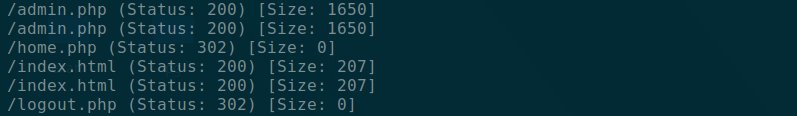

This is a walkthrough for Symfonos 5.2 Vulnhub machine. The machine can be found at [Symfonos 5.2 Vulnhub](https://www.vulnhub.com/entry/symfonos-52,415/). I really wanted to write a walkthrough on this box because I learnt a lot about LDAP Injections and insecure coding practices from it. So, let's dive right into it!

## Enumeration
First, using the `autorecon` tool, I looked at the nmap scan of the machine. The following ports were open:

```bash
PORT    STATE SERVICE  REASON         VERSION
22/tcp  open  ssh      syn-ack ttl 64 OpenSSH 7.9p1 Debian 10+deb10u1 (protocol 2.0)
| ssh-hostkey: 
|   2048 16:70:13:77:22:f9:68:78:40:0d:21:76:c1:50:54:23 (RSA)
| ssh-rsa AAAAB3NzaC1yc2EAAAADAQABAAABAQDfhCNEk87fJIphggJ/K7+9vu2pm9OmRmuYZ4tIPDCr42LgzGp6EIWpz5FXo98F1iq1pNASEjcMqqpCxuhhOFSlf3pPA00Rka4/0pmlmtIl5jSE6cpexIXzINzLC6YXDt59JFuOi0PgsbBYbIWsRdNxPboBDELeilgNairkx3wakNr39Di1SmrpQyQ54EbpusuNZPZL9eBjgEScXrx+MCnA4gyQ+VwEbMXDBfC6q5zO+poZQ1wkAqg9+LFvd2RuwGB+06yFfVn84UpBh4Fxf+cpnKG0zJalRfI8ZhUgnvEnU7cIp8Yb94pUzXf1+m1Vsau8+0myI0aaljHt4RfSfI3T
|   256 a8:06:23:d0:93:18:7d:7a:6b:05:77:8d:8b:c9:ec:02 (ECDSA)
| ecdsa-sha2-nistp256 AAAAE2VjZHNhLXNoYTItbmlzdHAyNTYAAAAIbmlzdHAyNTYAAABBBHUvkrh2jAIVELCTy59BYzC3B0S4/jKkYOmS6N7anjrxvHW59thSrs7+3pvVhM5X0Og+FV4zkrMMfvw5jwTygeA=
|   256 52:c0:83:18:f4:c7:38:65:5a:ce:97:66:f3:75:68:4c (ED25519)
|_ssh-ed25519 AAAAC3NzaC1lZDI1NTE5AAAAIKxA6/wOoEAbxcDJX8zdCYFQzulYfpxK4n4e7bUSUeeC
80/tcp  open  http     syn-ack ttl 63 Apache httpd 2.4.29 ((Ubuntu))
| http-methods: 
|_  Supported Methods: OPTIONS HEAD GET POST
|_http-server-header: Apache/2.4.29 (Ubuntu)
|_http-title: Site doesn't have a title (text/html).
389/tcp open  ldap     syn-ack ttl 63 OpenLDAP 2.2.X - 2.3.X
636/tcp open  ldapssl? syn-ack ttl 63
```

From the ports, LDAP sticks out particularly. Perhaps that may come in useful later. 

### Enumerating Port 80
Running a quick gobuster shows that the following `.php` pages are available.



Navigating to `/admin.php` reveals a login form. However, after trying common SQL Injection payloads, this form does not seem be vulnerable to SQLi.

My initial thought process was to enumerate LDAP for potential users and possibly brute-force the form with a known user. 
However, running the following command did not yield any results. Perhaps we are not allowed to access it without the right credentials. 

```bash
ldapsearch -h 192.168.204.141 -x
``` 

## Exploitation 
A while later, the idea dawned on me that this could be LDAP Injection. I had heard of the concept prior to doing this box, but did not know much about it. As such, I went to read up a bit on LDAP Injections. 

### A Short Primer on LDAP Injections
Lightweight Directory Access Protocol (LDAP) is a protocol that manages directory information. Directory information is stored in a tree-like hierarchical structure. Information is modelled as an entry which contains attributes, and entries are typically real world organizations, people and objects. 

LDAP Injections occur in a similar manner to SQL injections, when user input is used directly in a query without adequate sanitization. 

One of the common vectors of an LDAP Injection is an authentication form like in this box. The vulnerable code often takes a shape as follows:
```php
$filter = "(&(uid=$username)(userPassword=$password))";
$result = ldap_search($ldap_ch, "dc=symfonos,dc=local", $filter);
```

As one can see, `$username` and `$password` are taken directly from user input and inserted into the query, allowing for manipulation through the use of `*` or `%00` to access all records and terminate the query prematurely etc. 

### Back to Symfonos 5
After suspecting this form could be vulnerable to LDAP Injection, I sent the request to Burp Intruder and ran an attack on the username parameter with various common LDAP Injection payloads. 

As seen from the picture, a few of them returned with positive results, with one of the payloads being `*))%00`. 

In response to the query above, such a payload would pre-maturely terminate the query.
```php
$filter = "(&(uid = *))%00 #ignore the rest because it terminates at null-byte
```

As such, this results in a trivial authentication bypass and we are in to the portal! 

### LFI? gfi!
Navigating around the pages, we immediately see that the url of the `portraits.php` page looks vulnerable to LFI, with a url as follows.

```bash
http://192.168.204.141/home.php?url=http://127.0.0.1/portraits.php
```

Using the php filter, I was able to extract the source code for `home.php` in base64. Upon decoding, we can see the vulnerable portion of code to LFI was as follows

```php
if (!empty($_GET["url"]))
{
    $r = $_GET["url"];
    $result = file_get_contents($r);
}
```
Seems like it'll be vulnerable to both LFI and RFI! My first thought process was try a reverse shell but all it did was print my reverse shell payload on the screen. 

### Back to LDAP
Ahhh, LDAP strikes again. 

Using the same techniques to retrieve the source code for `home.php`, I retrieved `admin.php` and saw something interesting in the code for the login form: admin credentials for LDAP!

```php
$bind = ldap_bind($ldap_ch, "cn=admin,dc=symfonos,dc=local", "qMDdyZh3cT6eeAWD");

    if (!$bind)
    {
        return false;
    }

    $filter = "(&(uid=$username)(userPassword=$password))";
    $result = ldap_search($ldap_ch, "dc=symfonos,dc=local", $filter);
```

As such, we can re-run `ldapsearch` to see if it gives us any new information. This time, I ran it through nmap.

```bash
nmap -p 389 --script ldap-search --script-args 'ldap.username="cn=admin,dc=symfonos,dc=local",ldap.password=qMDdyZh3cT6eeAWD' 192.168.204.141
```

And we get Zeus' credentials!

We can then SSH into Zeus' box. 

## Privilege Escalation (nothing more almighty than the ruler of all gods but ROOT)
A quick check on Zeus' sudo privileges reveals the following.

Aha! A quick search in GTFOBins later, and we can achieve root via the following:
```bash
sudo -l dpkg
!/bin/sh
```

## Learning Points
1. LDAP Injections were my key takeaway from this box. Thanks to this box, I now know basic insecure coding practices that could potentially lead to LDAP Injections. 

2. `ldapsearch` does not always have to be used at the initial stages of our enumeration. Sometimes, we may need to dig around for adequate credentials first. However, LDAP often will reveal sensitive information about users!

3. LFI/RFI is not just about reading sensitive files on the host machine or trying to get a reverse shell! Sometimes, we should check the source code or `config.php` for any sensitive information that we may be able to access. 

Hope you enjoyed this little write-up! To more learning ahead :)